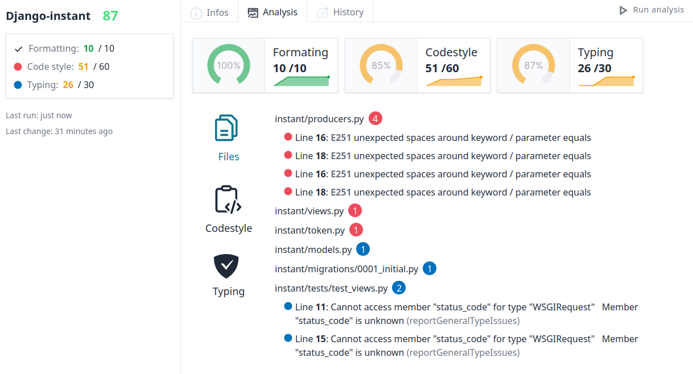
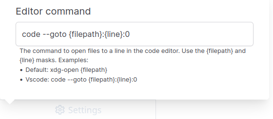
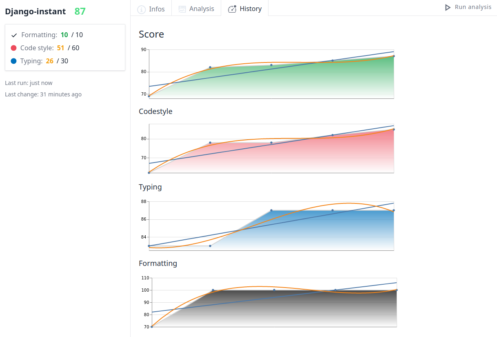

# Pycheck

An opinionated code quality checker for Python. Pycheck runs some code checking
tools, shows the problems and generates a note for the code. Checks:

- **Formating** with Black
- **Codestyle** with Flake8
- **Typing** with Pyright

<div align="center">

</div>

## Packages

| Version | Name | Description |
| --- | --- | --- |
| [](https://www.npmjs.com/package/@pycheck/cli) | [@pycheck/cli](https://www.npmjs.com/package/@pycheck/cli) | The terminal client |
| [](https://www.npmjs.com/package/@pycheck/ui) | [@pycheck/ui](https://www.npmjs.com/package/@pycheck/ui) | The in browser user interface |
| [](https://www.npmjs.com/package/@pycheck/types) | [@pycheck/types](https://www.npmjs.com/package/@pycheck/types) | The Typescript shared data structures |

## Terminal client

### Install

**Requirements**: to have the base tools installed: [Black](https://pypi.org/project/black/), 
[Flake8](https://pypi.org/project/flake8/) and [Pyright](https://pypi.org/project/pyright/):

```bash
# install the python packages
pip install black flake8 pyright
```

Install Pycheck:

```bash
yarn global add @pycheck/cli
# or 
npm install -g @pycheck/cli
```

This way you can run `pycheck` in any project directory

### Run

To run Pycheck vs any python directory:

```bash
pycheck /my/python/dir
```

With no parameters it will run in the current directory, looking for python code

Available options:

- `-s`: display suggestions about how to resolve the problems
- `-v`: will display more info (the list of files to format)
- `--debug`: print the commands
- `--disable-typing`: an option to not run the Pyright checks, just Flake and Black

### Presets

Some presets options are available for the level of checks:

- `--untyped`: to run with permissive type checking
- `--django`: to run for a Django project

Example with options:

```
pycheck -s --untyped
```

It is possible to declare a preset in the `setup.cfg` file in your project instead
of using a command line flag:

```ini
[pycheck]
preset = django
```

### Ignore options

#### Pyright

To ignore files in Pyright declare the list in a `pyrightconfig.json` file at the root
of your project:

```json
{
  "exclude": [
    "build",
    "dist"
  ]
}
```

#### Flake

To ignore files in Flake8 declare a section in your `setup.cfg` file:

```ini
[flake8]
max-line-length = 88
exclude = .git,.venv,build,__pycache__,*/migrations/*
```

#### Black

By default the exclude list for Black will use the one of Flake if declared. To
disable this behavior, in `setup.cfg`:

```ini
[pycheck]
black-ignore = disabled
```

To provide a custom regex ignore string to Black:

```ini
[pycheck]
black-ignore = '\\.git|\\.venv|build|__pycache__|\\*/migrations/\\*'
```

### Example output:

```
Using preset untyped
Checking formatting with Black ...
Checking codestyle with Flake8 ...
Checking typing with Pyright ...

-----------------------
☢️  Found some problems:
-----------------------

🔴 (3) sandbox/settings/tests.py
  - 1: F403 'from sandbox.settings.base import *' used; unable to detect undefined names
  - 14: F405 'join' may be undefined, or defined from star imports: sandbox.settings.base
  - 19: F405 'VAR_PATH' may be undefined, or defined from star imports: sandbox.settings.base
🔴 (2) docs/conf.py
  - 1: E402 module level import not at top of file
  - 1: E402 module level import not at top of file
🔴 (5) docs/django_settings.py
  - 1: F401 'os.listdir' imported but unused
  - 1: F401 'os.path.normpath' imported but unused
  - 1: E402 module level import not at top of file
  - 1: F403 'from demospa.settings import *' used; unable to detect undefined names
  - 1: F401 'demospa.settings.*' imported but unused
🔴 (1) sandbox/settings/demo.py
  - 1: F403 'from sandbox.settings.base import *' used; unable to detect undefined names
🔵 (4) sandbox/settings/tests.py
  - 11: "join" is not defined (reportUndefinedVariable)
  - 11: "VAR_PATH" is not defined (reportUndefinedVariable)
  - 18: "join" is not defined (reportUndefinedVariable)
  - 18: "VAR_PATH" is not defined (reportUndefinedVariable)
🔵 (2) sandbox/settings/demo.py
  - 12: "join" is not defined (reportUndefinedVariable)
  - 12: "VAR_PATH" is not defined (reportUndefinedVariable)
⚫ 25 files could be formated
Code score: 68/100
  - Formating: 0/10
  - Codestyle: 44/60
  - Typing: 24/30
```

## In browser user interface

### Install

```bash
yarn global add @pycheck/ui
# or 
npm install -g @pycheck/ui
```

### Run

```bash
cd my/python/project
pycheckui
```

Open `localhost:5143`

### Database

By default it will create a `.pycheck.db` file in the running directory (a Sqlite database to store history). To change this
behavior you can provide a database path:

```bash
# absolute path
pycheckui --db=/path/to/pycheck.db
# relative path: relative to the running directory
pycheckui --db=path/to/pycheck.db
```

It is possible to use only one database for all projects with this flag

### Editor

Configure your editor command to open some files directly from the ui. Use the settings
button in the bottom left corner:

<div align="center">

</div>

## More Screenshots

### History

<div align="center">

</div>

### Package versions

<div align="center">

</div>
